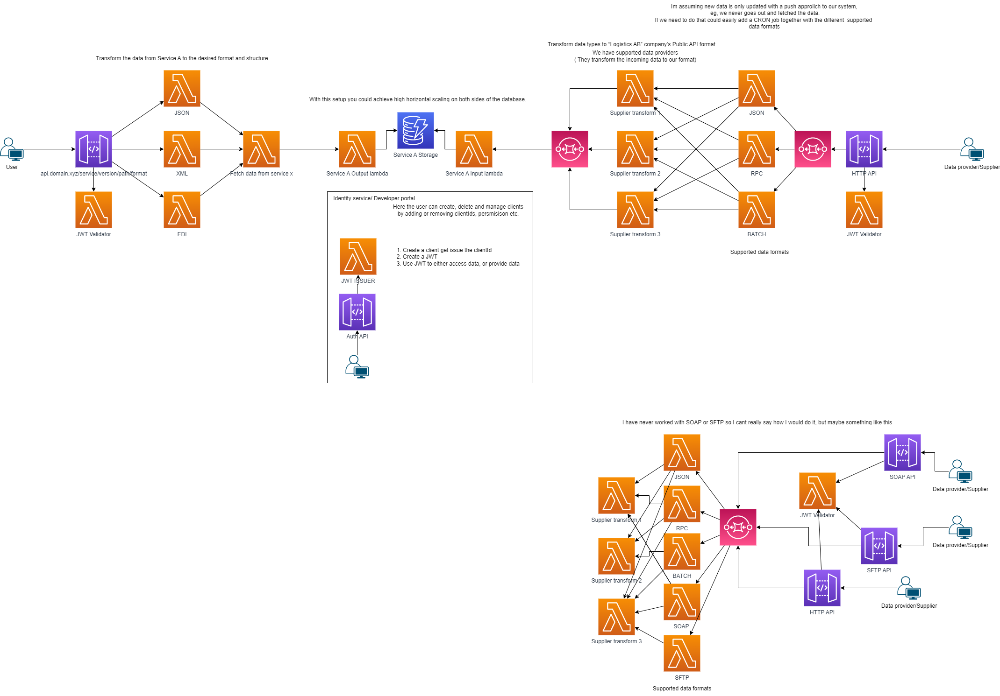

## Part 1
I would say I achieved the goal, but Im confused about task #4.
Products already has data in the database, so Im not really sure what data to insert there.

1. reads a csv file from a defined folder (there is an attached csv file in ohs-api-test/bootstrap/integration/order-integration.csv folder)
2. parses the information into user and product object
3. for user objects, use the user service to save the data
4. for product objects, use the product service to save the data
5. for every row processed, write out the following values ( userPid , orderPid and supplierPid ) from the row to a new file called processed-orders.json

Run docker-compose up to start the other services

Build docker file
`docker build -t integration-service-demo .`

Run docker container
`docker run -v "/home/robin/work/ohs-api-test (1)/ohs-api-test/bootstrap/integration":/app/files --network=intel_ohs integration-service-demo`

See dockerfile for environment variables needed to run outside a docker container 

## Part 2

 